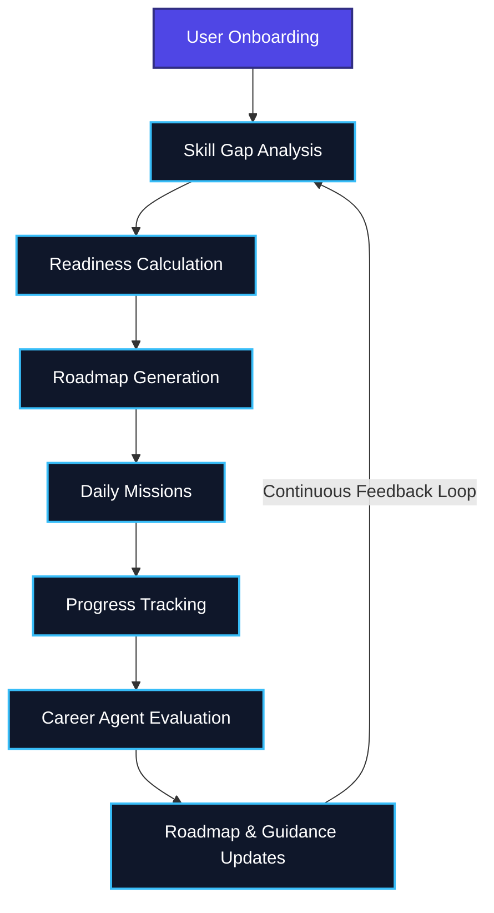

# 🚀 Mentra.AI

### From Confused Student to Placed Professional

## Tagline

India's first Generative + Agentic AI Career Intelligence Platform that identifies skill gaps, monitors market demands, and continuously adapts personalized learning journeys.

---

# 🌐 Live Demo

## 🔥 Try Mentra.AI

aimentra-three.vercel.app

### GitHub Repository

(https://github.com/Sasha-Mx/Mentra.AI)

---

# 📌 Project Overview

Mentra.AI is a Generative and Agentic AI powered Career Intelligence Platform designed to bridge the gap between academic learning and industry expectations.

Students today face fragmented career preparation across multiple platforms for learning, interview preparation, resume building, application tracking, and market research. While resources are abundant, personalized guidance is often missing.

Mentra.AI unifies the entire career preparation journey into a single adaptive ecosystem that helps users understand their current skill level, identify career gaps, build personalized learning plans, prepare for interviews, optimize resumes, track applications, and make informed career decisions using industry benchmark data and AI-driven intelligence.

By combining deterministic analytics with Generative AI and Agentic AI workflows, Mentra.AI transforms career preparation into a structured, personalized, and continuously evolving experience.

---

# ❓ Problem Statement

Every year millions of students graduate without a clear understanding of what the industry expects from them.

Common challenges include:

* Lack of personalized career guidance
* Fragmented learning across multiple platforms
* Difficulty identifying role-specific skill gaps
* Generic roadmaps that ignore current skill levels
* Poor interview readiness
* Resume optimization challenges
* Limited visibility into industry trends
* Unstructured application management

Students often spend months consuming content without knowing whether it contributes to their career goals.

The problem is not a lack of content.

The problem is a lack of direction.

Mentra.AI solves this by providing personalized career intelligence that continuously guides users toward job readiness.

---

# 💡 Solution

Mentra.AI acts as an intelligent career mentor that understands a user's profile, analyzes their current skills against industry benchmarks, generates personalized roadmaps, tracks progress, and adapts recommendations as users grow.

Instead of asking users to figure everything out themselves, Mentra.AI provides a clear path from:

Skill Discovery

↓

Gap Analysis

↓

Roadmap Generation

↓

Daily Execution

↓

Interview Preparation

↓

Resume Optimization

↓

Application Tracking

↓

Placement Readiness

---

# Core Features

## 🧠 AI Skill Gap Analyzer

* Industry benchmark driven analysis
* Role-specific skill assessment
* Categorized gaps:

  * Already Known
  * Needs Polishing
  * Daily Practice
  * Fully Missing
* Readiness evaluation
* Personalized insights

---

## 🗺 Personalized Roadmap Generator

* AI-generated learning paths
* Adaptive week-by-week plans
* Gap-focused learning
* Resource recommendations
* Project-based milestones
* Personalized progression strategy

---

## ⚡ Career Decision Intelligence

* Job market analysis
* Emerging skills detection
* Market fit scoring
* Company expectation mapping
* Growth path recommendations
* Opportunity analysis
* Impact simulations
* Career intelligence reports

---

## 🎯 Daily Missions System

* AI-generated personalized tasks
* Learn, Practice, Build framework
* Progress reinforcement
* Consistency tracking
* Adaptive recommendations

---

## 🎤 AI Mock Interview Engine

* Technical interviews
* HR interviews
* System Design interviews
* Dynamic question generation
* Per-answer evaluation
* Improvement suggestions
* Readiness tracking

---

## 📄 Resume Intelligence

* ATS compatibility scoring
* Resume quality assessment
* Keyword gap analysis
* Bullet point rewriting
* Actionable recommendations
* Resume optimization assistance

---

## 📊 Smart Application Tracker

* Application management
* Pipeline analytics
* Company research
* Interview preparation
* Stage-based checklists
* Follow-up tracking
* Rejection recovery guidance

---

## 📈 Peer Benchmarking

* Cohort comparison
* Percentile rankings
* Performance analysis
* Industry readiness comparison

---

## 💰 Salary Intelligence

* Current salary estimation
* Potential salary projections
* Growth opportunity analysis
* Role-specific salary insights

---

## 🎮 Gamification Layer

* XP system
* Levels
* Streaks
* Badges
* Confidence score
* Progress visualization

---

## 🧠 Agentic Intelligence Layer

### Why Mentra.AI is Agentic
Mentra.AI does not simply generate static content on demand. The platform continuously evaluates user progress, recalculates readiness, updates skill gaps, adapts learning priorities, generates new missions, and provides updated guidance based on changing user performance and career goals. This creates a continuous **observe → analyze → decide → act** loop rather than a single prompt-response interaction.

### Core Framework Modules
1. **Calibration & Profiling Module**: Evaluates user inputs (role, year, skills) and dynamically computes their *Experience Tier* (Beginner, Intermediate, Advanced) and initial *Market Fit Score* based on curated hiring trend references.
2. **Market Intelligence Module**: Utilizes industry benchmark datasets, market intelligence models, and role-specific skill mappings to compute payoff potential and target company expectations.
3. **Daily Mission Engine (Bloom's Taxonomy)**: Translates broad roadmap goals into a sequence of actionable *Learn → Practice → Build* tasks, forcing proof of work.
4. **Grading & Assessment Loop (Interview Engine)**: Conducts interactive mock interviews, adjusting difficulty based on identified skill gaps and grading user responses to dynamically recalculate their *Readiness Score*.
5. **Resume Benchmarking Module**: Audits resumes against Google’s XYZ format, Harvard OCS guidelines, and ATS parameters, pinpointing weak points and proposing rewrites.

### Agentic Loop Workflow



---

# ⚙️ Technical Architecture

### Frontend

* React.js
* Vite
* Tailwind CSS
* Framer Motion

### Backend

* Node.js
* Express.js

### Database

* MongoDB Atlas

### Authentication

* JWT
* bcryptjs

### AI Layer

* OpenRouter API
* Google Gemini
* Llama Models

### Hosting & Deployment

* Vercel (Frontend)
* Render (Backend)
* MongoDB Atlas (Database)

---

# 🧠 Innovation

Mentra.AI combines three powerful approaches:

### Deterministic Intelligence

Industry benchmark driven skill gap analysis, readiness scoring, salary estimation, and benchmarking.

### Generative AI

Personalized roadmaps, interviews, missions, resume feedback, and recommendations.

### Agentic AI

Continuous monitoring, adaptation, recalculation, and intelligent career guidance.

Unlike traditional learning platforms or generic AI chatbots, Mentra.AI provides a complete career readiness ecosystem that evolves with the user.

---

# 🛠 Running Locally ( Live Demo Without Setup Provided Above)

## Clone Repository

```bash
git clone <repository-url>
cd mentra-ai
```

## Install Frontend Dependencies

```bash
cd frontend
npm install
```

## Install Backend Dependencies

```bash
cd backend
npm install
```

### 3. Environment Setup

Create a `.env` file in the `server` directory:

```env
PORT=5000
MONGODB_URI=your_mongodb_connection_string
JWT_SECRET=your_secret_key
OPENROUTER_API_KEY=your_openrouter_api_key
VITE_YOUTUBE_API_KEY=your_youtube_api_key
```

### 4. Start the Application

Start the backend (from the `server` directory):

```bash
node index.js
```

## Run Frontend

```bash
npm run dev
```

---

# 👥 Team Details

## Team Name

Blue Eagle

## Team Member

### Sara Dhoundiyal

Roles:

* Product Architect
* Full Stack Developer
* AI Engineer
* Backend Developer
* Frontend Developer
* UI/UX Designer
* Prompt Engineer
* Research & Strategy
* Deployment & DevOps

---

# 🔮 Future Scope

* Real-time job scraping
* Company-specific preparation pathways
* AI career mentor assistant
* Live market intelligence updates
* Collaborative mock interviews
* Spaced repetition learning
* Mobile application
* University and placement cell integrations

---

# Closing Note

Mentra.AI was built around a simple question:

**Why does every platform tell students what jobs exist, but almost none tell them exactly how to become qualified for those jobs?**

Mentra.AI is our answer.

A personalized career intelligence system that transforms confusion into clarity, guidance into action, and preparation into opportunity.
